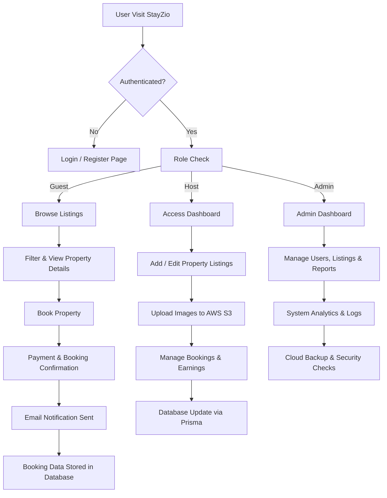
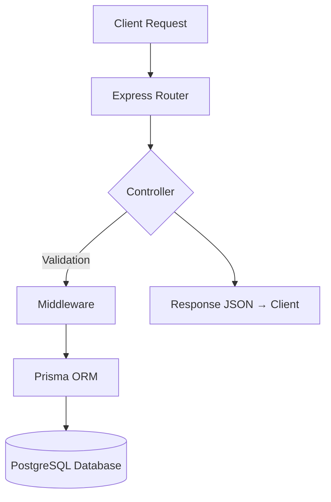
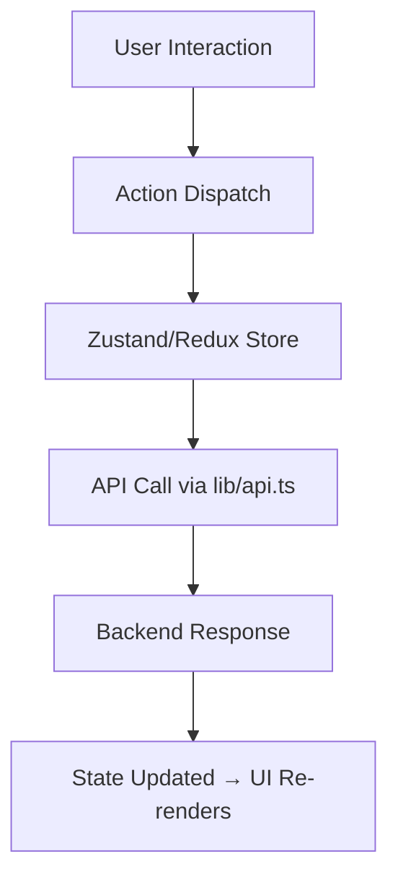

# 🏡 StayZio — Cloud-Powered Rental Management Platform

**StayZio** is a full-stack rental platform that enables property owners to manage listings and bookings seamlessly while allowing guests to explore, book, and review accommodations — all in a secure cloud-integrated environment with Next.js frontend, AWS Cognito for authentication, Node.js backend, and AWS RDS and S3 for database and storage.

---

## 🚀 Tech Stack

| Layer | Technology |
|-------|-------------|
| **Frontend** | Next.js (App Router, TypeScript, Tailwind CSS, Zustand) |
| **Backend** | Node.js + Express.js |
| **Database ORM** | Prisma (PostgreSQL) |
| **Cloud Services** | AWS EC2 / S3 |
| **Authentication** | JWT-based Auth (Role-based) |
| **State Management** | Redux Toolkit |
| **Styling** | Tailwind CSS + ShadCN UI |
| **Deployment** | Vercel (Frontend), AWS EC2 (Backend) |

---

## 🧠 Project Structure

```
StayZio/
├── client/                 # Frontend (Next.js)
│   ├── src/
│   │   ├── app/            # App Router (Auth, Dashboard, Listings, etc.)
│   │   ├── components/     # Reusable UI components
│   │   ├── hooks/          # Custom React hooks
│   │   ├── state/          # Redux 
│   │   ├── lib/            # Utility functions & API client
│   │   └── types/          # Global TypeScript types
│   └── package.json
│
├── server/                 # Backend (Express + Prisma)
│   ├── src/
│   │   ├── controllers/    # Route controllers (auth, bookings, listings)
│   │   ├── routes/         # REST API routes
│   │   ├── middleware/     # Authentication & validation middlewares
│   │   └── index.ts        # Entry point
│   ├── prisma/             # Prisma schema & migrations
│   └── package.json
│
└── README.md
```

---

## ⚙️ Key Features

### 🏘️ For Property Owners
- Add, edit, and delete property listings.
- Manage rental pricing, availability, and images.
- Track and manage bookings.

### 👥 For Guests
- Browse and filter properties by city, price, and amenities.
- Book instantly or request availability.
- Leave ratings and reviews.

### 🔒 Authentication & Roles
- JWT-based authentication with roles: `admin`, `host`, `guest`.
- Protected routes and session persistence.

### ☁️ Cloud Integrations
- Image uploads to **AWS S3**.
- Deployment on **AWS EC2** for scalability.

### 🗄️ Backend Services
- **Prisma ORM** for structured database interaction.
- REST APIs with **Express** for listings, users, and bookings.

### 🎨 Modern Frontend
- Responsive UI with **TailwindCSS + ShadCN**.
- Modular and type-safe architecture.
- Built on **Next.js App Router**.

---

## 🧭 Complete Application Workflow



---

## ⚙️ API Architecture (Backend)



---

## 🧩 State Management Flow (Frontend)



---

## 🧰 Installation & Setup

### 🖥️ Backend Setup
```bash
cd server
npm install

# Create .env file
cp env.example .env

# Run Prisma migrations
npx prisma migrate dev

# Start backend
npm run dev
```

### 💻 Frontend Setup
```bash
cd client
npm install

# Create .env file
cp env.example .env.local

# Run development server
npm run dev
```

Visit 👉 [http://localhost:3000](http://localhost:3000)

---

## 🌩️ Deployment

### Frontend
Deployed on **Vercel**
```bash
npm run build
vercel deploy
```

### Backend
Hosted on **AWS EC2** using PM2
```bash
pm2 start ecosystem.config.js
```


Sample Images


